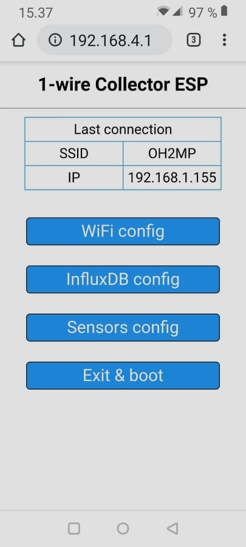
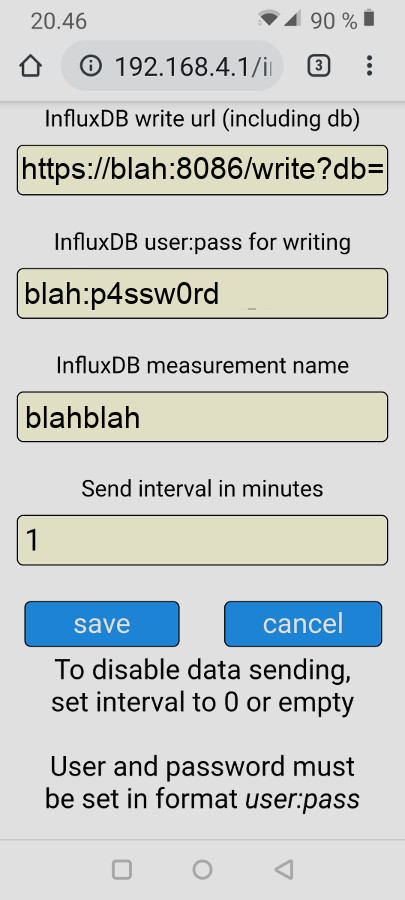

# esp8266 onewire to InfluxDB client
A simple WLAN-configurable onewire temperature reader that sends data to an InfluxDB

-----------

__This software is not maintained anymore. I suggest using [OH2MP ESP8266-DS1820-MQTT](https://github.com/oh2mp/esp8266_ds1820_mqtt) instead.__

-----------

## Hardware prerequisities
- An esp8266 board
- One or more Dallas DS18?20 sensors

## Software prerequisities
- [InfluxDB](https://www.influxdata.com/) running somewhere in the internet
(or another software that can handle similar POST request).
- [Arduino IDE](https://www.arduino.cc/en/main/software)
- [Arduino ESP8266 filesystem uploader](https://github.com/esp8266/arduino-esp8266fs-plugin)

Required libraries:

OneWire, DallasTemperature, ESP8266WiFi, ESP8266WiFiMulti,  ESP8266HTTPClient, WiFiClientSecure,
WiFiClient, DNSServer, ESP8266WebServer, FS

Use the filesystem uploader tool to upload the contents of data library. It contains the html pages for
the configuring portal.

## Connections
Connect your sensors to pin D2. This can be configured from the code too, see row `#define ONE_WIRE_BUS PIN_D2`

If you use parasite power, put a 4k7 resistor between 1wire data line and 3V3.

You can connect a switch between D1 and GND. If D1 is grounded, the esp8266 starts portal mode. The pin can be
also changed from the code, see row `#define APREQUEST PIN_D1`

By default the software assumes that there are maximum 8 sensors, but this can be changed from the code,
see row `#define MAX_SENSORS 8`

## Sending to your InfluxDB
Both onboard leds are lit when the sofware is sending data. Quite lot of information is sent also to the
serial line, so you can test it with the serial monitor of Arduino IDE.

## Portal mode
When your board is in portal mode, it blinks both onboard LEDs. Take your phone and connect to WiFi network 
**ESP8266 1WIRE** and accept that there's no internet connection etc.

Open your browser and go to `http://192.168.4.1/`

The web GUI should be self explanatory.

There's almost no sanity checks for the data sent from the forms. This is not a public web service and if you
want to mess up your board or make a denial of service to it using eg. buffer overflows, feel free to do so.

### Sample screenshots from the portal

